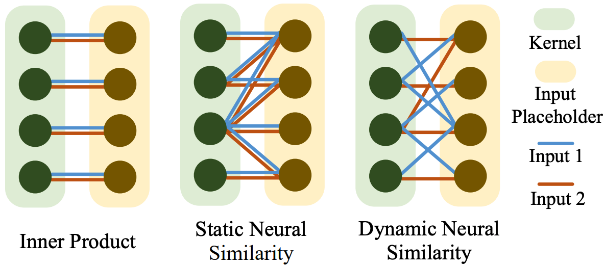

# Neural Similarity Learning

By Weiyang Liu*, Zhen Liu*, James Rehg, Le Song (* equal contribution)

### License

NSL is released under the MIT License (refer to the LICENSE file for details).

### Updates
- [x] Code for image classification on CIFAR-10/100 </li>
- [x] Code for Self-Attention SphereNet (Global Neural Similarity) </li>
- [ ] Code for few-shot classification on Mini-ImageNet </li>

### Contents
0. [Introduction](#introduction)
0. [Citation](#citation)
0. [Requirements](#requirements)
0. [Usage](#usage)


### Introduction

Inner product-based convolution has been the founding stone of convolutional neural networks (CNNs), enabling end-to-end learning of visual representation. By
generalizing inner product with a bilinear matrix, we propose the neural similarity which serves as a learnable parametric similarity measure for CNNs. Neural similarity naturally generalizes the convolution and enhances flexibility. Further, we consider the neural similarity learning (NSL) in order to learn the neural similarity adaptively from training data. Specifically, we propose two different ways of learning the neural similarity: static NSL and dynamic NSL. Interestingly, dynamic neural similarity makes the CNN become a dynamic inference network. By regularizing the bilinear matrix, NSL can be viewed as learning the shape of kernel and the similarity measure simultaneously.

Our paper is accepted to **NeurIPS 2019**. The full paper is available at [arXiv](https://arxiv.org/abs/1910.13003) and [here](https://wyliu.com/papers/LiuNSL2019.pdf)



### Citation

If you find our work useful in your research, please consider to cite:

    @InProceedings{LiuNIPS19,
      title={Neural Similarity Learning},
      author={Liu, Weiyang and Liu, Zhen and Rehg, James and Song, Le},
      booktitle={NeurIPS},
      year={2019}
    }

### Requirements
1. `Python 3.7`
2. `TensorFlow` (Tested on version 1.14)
3. `numpy`


### Usage

#### Part 1.1: Clone the repositary
  - Clone the repositary.

	```Shell
	git clone https://github.com/wy1iu/NSL.git
	```

#### Part 1.2: Download the CIFAR-10/100 data
  - Run the bash script.
	```Shell
	./dataset_setup.sh
	```

#### Part 2: Image Classification on CIFAR-10/100
  - Training NSL on CIFAR-10 (e.g. dynamic neural similarity network with DNS)

	```Shell
	cd $NSL_ROOT/NSL/nsl_image_recog/experiments_cifar10/dynamic_dns/
	python train.py
	```

  - To train the other models CIFAR-10, change the foler to the corresponding one.
  
  - Training NSL on CIFAR-100 (e.g. dynamic neural similarity network with DNS)
  
	```Shell
	cd $NSL_ROOT/NSL/nsl_image_recog/experiments_cifar100/dynamic_dns/
	python train.py
  	```
  - Best-performing model: NSL with full SphereNet as the neural similarity predictor
  
	```Shell
	cd $NSL_ROOT/NSL/nsl_image_recog/nsl_fspherenet/
	python train_nsl_fs.py
  	```

#### Part 3: Global Neural Similarity (Self-attention SphereNet)

  - We implement a self-attention SphereNet as an example of global neural similarity (described in Appendix B of our paper).
	```Shell	
	cd $NSL_ROOT/NSL/sa-spherenet
	python train_sa.py
  	```


